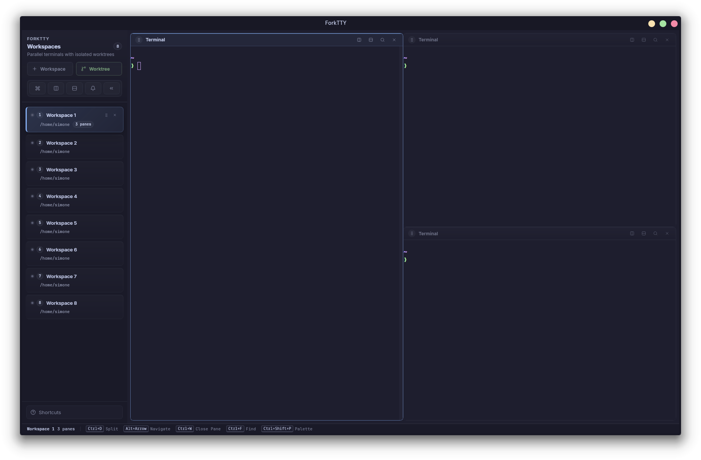

<div align="center">


# ForkTTY

**Linux-first multi-agent terminal with a programmable local socket API, first-class git worktrees, and prompt-aware notifications.**

Run several coding agents in one desktop window. ForkTTY keeps their terminals and workspace state separated, can place agents in isolated git worktrees, exposes a user-local Unix socket for automation, and surfaces unread prompts when a background workspace needs attention.

[](LICENSE)
[](https://github.com/Lucenx9/forktty/actions)
[](https://github.com/Lucenx9/forktty/releases/latest)
[](https://rustup.rs/)
[](https://v2.tauri.app/)

[Download Latest Release](https://github.com/Lucenx9/forktty/releases/latest)



</div>

> **Status**: Early development (v0.1.2). ForkTTY is usable on Linux, but the runtime surface is still changing. There are no macOS or Windows builds.

## Why ForkTTY

- **Agent-agnostic automation**: one local socket API and one CLI flow for Codex, Claude Code, and Gemini CLI instead of a UI tied to a single agent vendor.
- **First-class worktree workflows**: spawn isolated worktree workspaces, keep branch/cwd metadata visible, and run optional `.forktty/setup` / `.forktty/teardown` hooks inside verified worktrees.
- **Local-first and privacy-first**: no telemetry, no update checks, no external network dependency, user-private Unix socket permissions, strict path validation, and CSP-locked app content.
- **Practical Linux desktop UX**: split panes, sidebar attention states, prompt-aware notifications, session restore, command palette, and tray integration in one app.

## 30-Second Automation

ForkTTY ships a repo-local CLI wrapper over the Unix socket API:

```bash
./scripts/forktty.mjs list
./scripts/forktty.mjs focus "Workspace 2"
./scripts/forktty.mjs surfaces
./scripts/forktty.mjs split-surface --axis vertical
./scripts/forktty.mjs worktree-status
./scripts/forktty.mjs notify --title "Input needed" --kind prompt "Blocked on test fixture"
./scripts/forktty.mjs clear-notifications
./scripts/forktty.mjs set-status --key agent:codex --label Codex --value Running --color blue
./scripts/forktty.mjs set-progress --key build --label Build --value 42 --total 100
./scripts/forktty.mjs log --level warn "Waiting for reviewer input"
./scripts/forktty.mjs logs
```

Inside a ForkTTY terminal, spawned shells already receive:

- `FORKTTY_WORKSPACE_ID`
- `FORKTTY_SURFACE_ID`
- `FORKTTY_SOCKET_PATH`

That means hooks and scripts can target the current workspace without extra flags.

Supported hook templates and installer flow:

```bash
./scripts/forktty.mjs hooks setup
./scripts/forktty.mjs hooks setup codex claude
```

The installer merges hook commands into:

- Codex: `$CODEX_HOME/hooks.json` or `~/.codex/hooks.json`
- Claude Code: `$CLAUDE_CONFIG_DIR/settings.json` or `~/.claude/settings.json`
- Gemini CLI: `~/.gemini/settings.json`

## Features

- **Linux desktop app** built with Tauri v2, Rust, React 19, TypeScript, and Vite.
- **Local socket API and CLI** for workspace, surface, notification, worktree, and metadata automation.
- **Agent-agnostic hook templates** for Codex, Claude Code, and Gemini CLI, with status pills and prompt notifications routed through the same local pipeline.
- **Git worktree workspaces** using native `git2` operations, configurable nested/sibling/outer-nested layouts, and optional `.forktty/setup` / `.forktty/teardown` hooks.
- **Split panes** powered by `react-resizable-panels`, with horizontal/vertical splits, drag resize, and `Alt+Arrow` navigation.
- **Workspace sidebar** with branch, directory, worktree status, unread counts, notification previews, drag reorder, and optional collapsed/right-side layouts.
- **xterm.js terminals** using `@xterm/xterm` 5.5 with Fit, Search, and Canvas addons.
- **Session persistence** for workspace order, active workspace, pane tree, focused pane, names, working directories, branches, and worktree metadata. PTYs and scrollback are not persisted.
- **Session restore hardening**: malformed or unsupported session files are ignored and quarantined; pane trees are validated before restore.
- **Prompt-aware notifications** from OSC 133, Claude-style prompt patterns, and OSC 9/99/777 terminal notification sequences.
- **Noise controls** for notifications: switch/restore suppression, short-window dedupe, and no repeated prompt notifications while a workspace is already unread.
- **Welcome/onboarding and polished dialogs**: first-run welcome overlay, safer focus defaults for destructive modals, and improved empty/loading/error states in settings, branch picker, command palette, notification panel, and pane spawn failures.
- **Ghostty theme compatibility** for local colors, font family, font size, and palettes, with explicit ForkTTY config taking precedence.
- **System tray integration** with unread-count tooltip and click-to-focus behavior when the desktop environment supports it.
- **Privacy-first defaults**: no telemetry, no update checks, no external network calls. See [PRIVACY.md](PRIVACY.md).

## Quick Start

### Requirements

- Linux with WebKitGTK 4.1 and AppIndicator/Ayatana libraries.
- [Rust 1.88+](https://rustup.rs/)
- [Node.js 20+](https://nodejs.org/)

Debian / Ubuntu:

```bash
sudo apt install libwebkit2gtk-4.1-dev build-essential \
  libssl-dev libayatana-appindicator3-dev librsvg2-dev
```

Fedora:

```bash
sudo dnf install webkit2gtk4.1-devel gtk3-devel libappindicator-gtk3-devel librsvg2-devel
```

GTK/VTE preview dependencies:

```bash
# Debian / Ubuntu
sudo apt install libgtk-4-dev libadwaita-1-dev libvte-2.91-gtk4-dev

# Fedora
sudo dnf install gtk4-devel libadwaita-devel vte291-gtk4-devel

# Arch
sudo pacman -S gtk4 libadwaita vte4
```

The GTK/VTE preview currently requires VTE 0.80 or newer for shell-integration
and progress termprops. For compositor-anchored quake/dropdown placement on
Wayland, install the optional `gtk4-layer-shell` runtime as well:

```bash
# Debian / Ubuntu
sudo apt install libgtk4-layer-shell-dev

# Fedora
sudo dnf install gtk4-layer-shell-devel

# Arch
sudo pacman -S gtk4-layer-shell
```

### Build and Run

```bash
git clone https://github.com/Lucenx9/forktty.git
cd forktty
npm install
npm run tauri:dev
```

The Linux-native GTK4/libadwaita/VTE path is available on the
`migration/gtk-vte` branch while the Tauri path remains in place for comparison
and fallback:

```bash
cargo run -p forktty-ui-gtk --features gtk-vte
```

### Work Inside an Isolated Ubuntu Container

If you do not want to install Node, Rust, WebKitGTK, or Tauri build dependencies on your host system, use the Ubuntu Docker environment included in this repository instead.

```bash
./scripts/ubuntu-dev.sh
```

That opens a shell inside an Ubuntu 24.04 container with Node, Rust, and the Linux dependencies needed for ForkTTY. From there you can work normally:

```bash
npm ci
npm run tauri:dev
npm test
cargo test --manifest-path src-tauri/Cargo.toml
```

You can also run one-off commands without entering an interactive shell:

```bash
./scripts/ubuntu-dev.sh npm test
./scripts/ubuntu-dev.sh bash -lc "npm ci && npm run tauri:build -- --bundles deb"
./scripts/ubuntu-build-deb.sh
```

The host-side footprint is limited to Docker itself, one image, a few named cache volumes, and the repository files/artifacts you explicitly create.

### Build Installers Locally

```bash
npm run tauri:build
sudo dpkg -i src-tauri/target/release/bundle/deb/ForkTTY_*.deb
```

GTK/VTE preview package:

```bash
bash scripts/gtk-build-deb.sh
sudo dpkg -i target/packaging/deb/forktty-gtk_*.deb
```

The AppImage is emitted under `src-tauri/target/release/bundle/appimage/` when the AppImage bundle is produced:

```bash
chmod +x src-tauri/target/release/bundle/appimage/ForkTTY_*.AppImage
src-tauri/target/release/bundle/appimage/ForkTTY_*.AppImage
```

The packaging script normalizes AppImage root symlinks, rejects unsafe icon values containing `/` or `..`, and patches the AppImage runtime environment for common WebKitGTK/GPU issues.

### Install from GitHub Releases

- Release page: https://github.com/Lucenx9/forktty/releases/latest
- Debian / Ubuntu / Linux Mint: download `ForkTTY_*.deb`, then install with `sudo dpkg -i`.
- Other Linux distributions: download `ForkTTY_*.AppImage`, `chmod +x` it, then run it directly.
- Prefer the native `.deb` on Debian-family systems; use the AppImage as the portable fallback.

```bash
# .deb example for the current 0.1.2 release
curl -LO https://github.com/Lucenx9/forktty/releases/latest/download/ForkTTY_0.1.2_amd64.deb
sudo dpkg -i ForkTTY_0.1.2_amd64.deb
```

```bash
# AppImage example for the current 0.1.2 release
curl -LO https://github.com/Lucenx9/forktty/releases/latest/download/ForkTTY_0.1.2_amd64.AppImage
chmod +x ForkTTY_0.1.2_amd64.AppImage
./ForkTTY_0.1.2_amd64.AppImage
```

## Keyboard Shortcuts

| Action | Shortcut |
| ------ | -------- |
| New workspace | `Ctrl+N` |
| New worktree workspace / branch picker | `Ctrl+Shift+N` |
| Close workspace | `Ctrl+Shift+W` |
| Jump to workspace 1-9 | `Ctrl+1`..`Ctrl+9` |
| Split right | `Ctrl+D` |
| Split down | `Ctrl+Shift+D` |
| Navigate panes | `Alt+Arrow` |
| Close pane | `Ctrl+W` |
| Find in terminal | `Ctrl+F` |
| Copy selection | `Ctrl+Shift+C` |
| Command palette | `Ctrl+Shift+P` |
| Notification panel | `Ctrl+Shift+I` |
| Jump to unread workspace | `Ctrl+Shift+U` |
| Settings | `Ctrl+,` |
| Zoom in / out / reset | `Ctrl+=` / `Ctrl+-` / `Ctrl+0` |

These shortcuts intentionally override some terminal defaults while the main app surface is focused. Text inputs, modals, the branch picker, and command palette block workspace-mutating shortcuts.

## Configuration

Config file: `~/.config/forktty/config.toml`. All fields are optional.

```toml
[general]
# "auto" reads Ghostty colors/fonts when available; "builtin" uses the fallback theme.
theme_source = "auto"

# Must be an absolute path to an executable file. Default: $SHELL, then /bin/bash.
shell = "/bin/bash"

# Worktree placement: "nested" (.worktrees/), "sibling", or "outer-nested".
worktree_layout = "nested"

# Empty disables custom commands.
# If set, the first token must be an absolute path to an executable file.
# Additional static arguments are currently supported through shell_words parsing.
notification_command = ""

[appearance]
font_family = ""
font_size = 14
sidebar_position = "left" # "left" or "right"

[notifications]
desktop = true
sound = true
```

Config loading is bounded to regular files of at most 1 MiB for ForkTTY's TOML config. Invalid saved settings are rejected when written from the app. Loaded config values are normalized where possible; spawned shells still require a valid executable path.

Ghostty users: ForkTTY reads `~/.config/ghostty/config` and theme files under `~/.config/ghostty/themes/` for compatible colors, font family, font size, and palette entries. Explicit `[appearance]` values override Ghostty-derived values.

### Custom Notification Command

`notification_command` runs in addition to desktop notifications when ForkTTY dispatches a notification.

- The command is split with `shell_words`; ForkTTY does not use `sh -c`.
- The first token must be an absolute path to an executable regular file.
- Additional static arguments are passed as argv if present.
- Pipes, redirection, variable expansion, globs, and shell operators are not interpreted.
- The notification payload is passed through environment variables:
  - `FORKTTY_NOTIFICATION_TITLE`
  - `FORKTTY_NOTIFICATION_BODY`

Example:

```toml
[general]
notification_command = "/usr/bin/notify-send --app-name ForkTTY"
```

A stricter future policy that disallows extra `notification_command` arguments is tracked as a follow-up, not current behavior.

## Session Restore

ForkTTY saves workspace layout through a debounced store subscription and attempts a final best-effort save on window unload. On startup it restores the workspace list, active workspace, pane tree, focused pane index, working directories, branch labels, and worktree metadata.

Restore does not preserve PTY processes or scrollback. New PTYs are spawned for restored panes. Corrupt or structurally invalid session files are renamed to `session.json.bad-*` and ignored so the app can start with a clean workspace.

Prompt notifications are suppressed briefly during restore and workspace switches to avoid false positives from shell redraws and terminal resizing.

## Worktree Behavior

Worktree workspaces are optional. `Ctrl+Shift+N` opens the branch picker, which can create a new branch from `HEAD` or attach a worktree to an existing branch. Layout is controlled by `general.worktree_layout`.

Socket-driven `worktree.*` operations validate caller-provided `cwd` values against repositories already open in the frontend. Subdirectories and linked worktrees in the same open repository are accepted; unrelated repositories are rejected. Removing the last worktree-backed workspace creates a replacement plain workspace rooted at the repository fallback path before closing the worktree workspace.

## Architecture

```text
Frontend (React 19 + TypeScript + Vite)
  - @xterm/xterm 5.5 with Fit, Search, and Canvas addons
  - react-resizable-panels recursive pane layout
  - Zustand workspace/config/metadata stores

Tauri v2 IPC
  - invoke commands for control paths
  - Channels for PTY output streaming
  - local event bridge for socket API requests

Backend (Rust)
  - portable-pty for PTY lifecycle
  - git2 for repository and worktree operations
  - output_scanner for OSC/prompt detection
  - notify-rust for desktop notifications
  - tokio + serde_json for the Unix socket API
```

## Security Summary

- Linux-only local desktop threat model; the current user is the primary trust boundary.
- Unix socket defaults to `$XDG_RUNTIME_DIR/forktty.sock`, validates private parent permissions, uses owner-only socket permissions, and enforces a 1 MiB request limit.
- Shell path and `notification_command` program path must be absolute executable files.
- Custom notification commands use argv execution, not `sh -c`; title/body are delivered via environment variables.
- Worktree names and paths are validated; hook execution is restricted to `.forktty/setup` and `.forktty/teardown` inside verified worktrees.
- AppImage packaging rejects unsafe icon path traversal values and refuses absolute root symlinks.
- CSP restricts the WebView to local app content.

See [SECURITY.md](SECURITY.md) for reporting instructions, residual risks, and the full local trust model.

## Known Limitations

- Linux only. There are no supported macOS or Windows builds.
- Dark theme only. CSS has limited system-preference handling, but no light-mode toggle.
- PTYs and scrollback are not persisted across restart.
- Session saves are debounced and the final `beforeunload` save is best effort.
- No idle-time notification detector; only prompt/OSC notification triggers are active.
- No end-to-end PTY backpressure. The frontend bounds pending output and may drop buffered bytes under sustained overload.
- Full Tauri GUI smoke tests and routine manual runtime QA are still backlog items.
- Documentation screenshots may lag small UI polish changes.

## Contributing

ForkTTY is in active early development. Keep changes small, verify the relevant surface, and avoid documenting behavior that is not implemented in the current code.

Useful commands:

```bash
npm run tauri:dev                         # Dev mode
npm run build                             # TypeScript + Vite production build
npm run lint                              # ESLint for src/
npm run test                              # Vitest suite
npm run tauri:build                       # Production Tauri build via packaging script
npm run tauri:info                        # Tauri environment info
cargo fmt --manifest-path src-tauri/Cargo.toml --check
cargo clippy --manifest-path src-tauri/Cargo.toml -- -D warnings
cargo test --manifest-path src-tauri/Cargo.toml
cargo fmt --all --check                   # GTK/VTE workspace
cargo test --workspace                    # GTK/VTE workspace
cargo build -p forktty-ui-gtk --features gtk-vte
bash scripts/gtk-build-deb.sh
npx prettier --check src/
```

See [SPEC.md](SPEC.md) for technical details and [ROADMAP.md](ROADMAP.md) for implemented, planned, and known backlog work.

## Inspiration

Built from scratch for Linux, inspired by [cmux](https://github.com/manaflow-ai/cmux) (macOS-only, Swift/AppKit).

## License

[GNU Affero General Public License v3.0](LICENSE) (`AGPL-3.0-only`)
