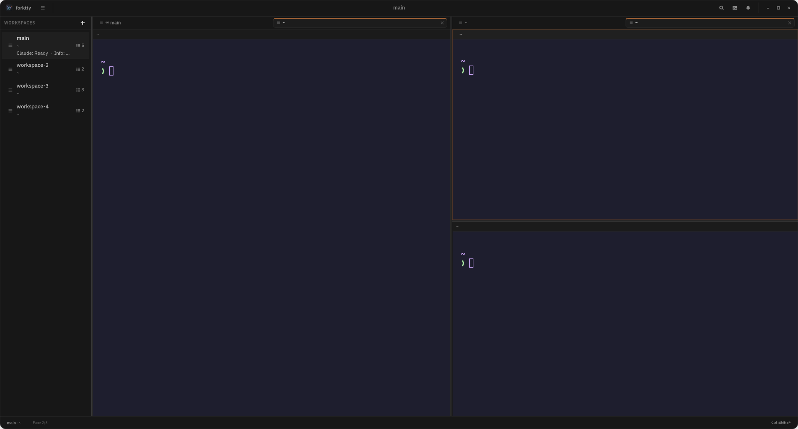

<div align="center">


# ForkTTY

**Linux-native multi-agent terminal with a programmable local socket API, first-class git worktrees, and prompt-aware notifications.**

ForkTTY runs coding agents in isolated workspaces, exposes a user-local Unix socket for automation, and can place long-running tasks in dedicated git worktrees without tying the UI to one agent vendor.

[](LICENSE)
[](https://github.com/Lucenx9/forktty/actions)
[](https://github.com/Lucenx9/forktty/releases/tag/v0.2.0-alpha.14)
[](https://rustup.rs/)
[](docs/native-gtk-ghostty.md)

[Website](https://forktty-site.vercel.app/) ·
[Download v0.2.0-alpha.14 AppImage](https://github.com/Lucenx9/forktty/releases/download/v0.2.0-alpha.14/forktty-0.2.0-alpha.14-x86_64.AppImage)

</div>

> **Status**: Early alpha (v0.2.0-alpha.14). ForkTTY is Linux-only and the GTK/Ghostty runtime is now the primary implementation. The AppImage is the primary Linux download for this alpha; the Debian package remains available for Debian/Ubuntu users.

<p align="center">
  
</p>

## Why ForkTTY

- **Agent-agnostic automation**: the same socket API and CLI flow work for Codex, Claude Code, Antigravity CLI, OpenCode, legacy Gemini CLI, shell scripts, and custom tools.
- **First-class worktree workflows**: create, attach, remove, and merge isolated worktree workspaces through native `git2` operations and optional `.forktty/setup` / `.forktty/teardown` hooks.
- **Native Linux terminal stack**: GTK4/libadwaita shell with embedded Ghostty-backed terminals, split panes, session restore, notifications, command palette, settings, and quake mode.
- **Local-first posture**: no crash reporting or product event tracking, an anonymous daily usage ping that can be disabled, owner-only Unix socket permissions, bounded request/session/config files, and argv-based command execution. Optional update checks hit GitHub Releases at most once per day and can also be disabled.

## Install

The fastest paths are the prebuilt artifacts from the
[v0.2.0-alpha.14 release](https://github.com/Lucenx9/forktty/releases/tag/v0.2.0-alpha.14).
Each release ships:

- `forktty-0.2.0-alpha.14-x86_64.AppImage` — recommended portable Linux package.
- `forktty-0.2.0-alpha.14-x86_64.AppImage.zsync` — AppImage delta-update metadata for external AppImage managers.
- `forktty_0.2.0.alpha.14_amd64.deb` — Debian/Ubuntu package.
- `SHA256SUMS` — checksums for release artifacts.

After downloading, verify checksums:

```bash
sha256sum -c SHA256SUMS
```

### AppImage

```bash
chmod +x forktty-0.2.0-alpha.14-x86_64.AppImage
./forktty-0.2.0-alpha.14-x86_64.AppImage
```

The AppImage always ships the vendored libghostty-vt library and prefers the
host's GUI stack: when the host provides GTK4, ForkTTY runs against the
system GTK4/libadwaita for native cursor themes, fontconfig, and portal
integration, and the bundled GTK copy is used only as a fallback on hosts
without GTK4. It depends on the host system for glibc, the GSettings/GIO
data tree, Wayland/X11 session services, fontconfig, the
OpenGL/Vulkan/Mesa driver stack, and desktop notification services.
It is the primary downloadable artifact for alpha releases and works on
most modern distros that ship a recent glibc, but it should
still be tested on the target distro/desktop environment before being
relied on.

ForkTTY checks GitHub Releases for updates at most once per day by default.
AppImage installs can update in place after confirmation: ForkTTY downloads
the new AppImage and `SHA256SUMS`, verifies SHA256, then atomically replaces
the current file. Non-AppImage installs open the release page instead. AppImage
managers such as Gear Lever continue to work when they launch ForkTTY from a
stable writable AppImage path; if ForkTTY sees an extracted, read-only, or
otherwise unsafe path, it falls back to the release page and leaves the manager
in control.

If the AppImage launches but the GTK interface renders incorrectly, try
an explicit GTK renderer from a terminal:

```bash
GSK_RENDERER=ngl ./forktty-0.2.0-alpha.14-x86_64.AppImage
```

### Debian / Ubuntu (.deb)

The `.deb` targets Debian 13/Trixie or newer and Ubuntu 24.04 LTS or newer.
Debian 12/Bookworm is below the package baseline because it does not provide
libadwaita 1.4+.

```bash
sudo apt install ./forktty_0.2.0.alpha.14_amd64.deb
# or, if apt cannot read the file path directly:
sudo dpkg -i forktty_0.2.0.alpha.14_amd64.deb
sudo apt -f install
```

The package installs the `forktty` binary, the desktop entry, and the
icon. Removing it (`sudo apt remove forktty`) cleans up
`/usr/bin/forktty` and the desktop integration.

### Build from source

Requirements:

- Linux
- [Rust 1.96+](https://rustup.rs/)
- GTK4 and libadwaita development files
- `git`, Zig, and the full Ghostty source submodule for the vendored Ghostty
  terminal libraries
- No system Ghostty package is required; source and packaged builds use the
  pinned vendored Ghostty libraries

Developer repository checks also expect the full Ghostty source submodule:

```bash
git submodule update --init vendor/ghostty
```

Debian / Ubuntu:

```bash
sudo apt install build-essential libssl-dev libgtk-4-dev libadwaita-1-dev git zig desktop-file-utils
```

Fedora:

```bash
sudo dnf install gcc gcc-c++ openssl-devel gtk4-devel libadwaita-devel git zig desktop-file-utils
```

Arch / CachyOS:

```bash
sudo pacman -S base-devel openssl gtk4 libadwaita git zig desktop-file-utils
```

ForkTTY requires libadwaita 1.4+, matching Debian 13/Trixie, Ubuntu 24.04 LTS,
and newer distro packages. For compositor-anchored quake/dropdown placement on
Wayland, install `gtk4-layer-shell` as an optional runtime dependency.

Clone and run:

```bash
git clone https://github.com/Lucenx9/forktty.git
cd forktty
git submodule update --init vendor/ghostty
scripts/ghostty-gtk-lib-probe.sh --ensure --print-path
cargo run -p forktty-ui-gtk
```

Packaged builds are GTK/Ghostty-only. The experimental WebKitGTK browser pane
remains in source behind the opt-in `browser` feature; it is not shipped in
the AppImage or `.deb` for this alpha.

For the explicit terminal-only build used by release artifacts:

```bash
cargo run -p forktty-ui-gtk --no-default-features --features gtk-ghostty
```

For the source-only browser experiment, install WebKitGTK 6 development files
and opt in:

```bash
cargo run -p forktty-ui-gtk --no-default-features --features browser
```

Build the Debian package locally:

```bash
bash scripts/build-deb.sh
sudo dpkg -i target/packaging/deb/forktty_*.deb
```

`scripts/build-deb.sh` and `scripts/build-appimage.sh` call
`scripts/ghostty-gtk-lib-probe.sh --ensure --print-path` before packaging and
fail if `ghostty-gtk-embed.so` cannot be built, located, or verified. The
verified library is installed into `usr/lib` beside the `forktty` binary so
installed terminal panes can load it through the binary RUNPATH without
`FORKTTY_GHOSTTY_GTK_LIB`.

Build the AppImage locally (requires `appimagetool` on
`PATH`, or `APPIMAGETOOL=/path/to/appimagetool`):

```bash
bash scripts/build-appimage.sh
./target/packaging/appimage/forktty-*-x86_64.AppImage
```

Set `APPIMAGE_UPDATE_INFO=1` when building release-style AppImages with
embedded update metadata; this requires `zsyncmake` on `PATH` and emits a
matching `.zsync` file.

## First Run

### Check the environment

After install, confirm the runtime looks healthy:

```bash
forktty --version
forktty doctor
```

`forktty doctor` is a local-only inspector. It reports the resolved
config, session, socket, hook config paths, and known recovery
behaviors, and exits 0 on a clean environment or 2 with explicit
warnings.

### Default workspace and shortcuts

ForkTTY opens the current directory as the `main` workspace. Use the
command palette for most navigation and pane actions:

- `Ctrl+Shift+P`: command palette
- `Ctrl+Shift+N`: new workspace
- `Ctrl+Shift+O`: open workspace
- `Ctrl+Shift+H`: split pane right
- `Ctrl+Shift+E`: split pane down
- `Ctrl+Shift+T`: new tab in the focused pane
- `Ctrl+Shift+W`: close pane
- `Ctrl++`/`Ctrl+=`, `Ctrl+-`, `Ctrl+0`: zoom terminal panes
- `Ctrl+B` or `F9`: toggle workspace sidebar
- Agents: titlebar button or command palette
- `Ctrl+Shift+M`: notifications
- `F1`: keyboard shortcuts
- `Ctrl+,`: settings

## Socket CLI

The same `forktty` binary speaks the local socket API. Diagnostic
commands work even when the GTK app is not running:

```bash
forktty --help
forktty --version
forktty doctor          # local diagnostics, no socket required
forktty ping            # check the running daemon
```

Workspace, surface, worktree, notification, and metadata commands talk
to the live socket:

```bash
forktty list
forktty focus "Workspace 2"
forktty ssh user@example.com
forktty surfaces --workspace-name main
forktty agents --workspace-name main
forktty agent-health --workspace-name main
forktty resume-agent --surface-id <surface-id>
forktty agent-reclaim-plan --workspace-name main --min-idle-ms 600000
forktty read-screen --surface-id <surface-id>
forktty capture-tail --surface-id <surface-id> --lines 80
forktty tree --workspace-name main
forktty top --workspace-name main
forktty split-surface --axis vertical
forktty new-tab
forktty send-text "cargo test\n"
forktty worktree-status
forktty notify --title "Input needed" --kind prompt "Blocked on test fixture"
forktty set-status --key agent:codex --label Codex --value Running --color blue
forktty set-progress --key build --label Build --value 42 --total 100
forktty statusline
forktty log --level warn "Waiting for reviewer input"
forktty notifications
forktty capabilities
forktty events
```

The titlebar Agent HUD shows persisted agent sessions across workspaces, highlights
sessions that need input, and can focus or resume a tracked agent. `forktty agents`,
`forktty agent-health`, and `forktty statusline` include the
hook-derived agent lifecycle (`running`, `idle`, `needs_input`, `ended`, or
`unknown`) when a provider session id has been persisted. `forktty agents` and
`forktty agent-health` also expose hook-derived `resume_cwd` and
`last_activity_ms`. For Antigravity CLI, `resume_cwd` comes from the hook
payload's `workspacePaths`, because `agy` executes the generated wrapper scripts
from `~/.gemini/config` rather than from the project directory.
After a ForkTTY restart, restored terminal panes with a supported persisted
agent session respawn through the provider's argv-only resume command, such as
`codex resume -C <resume_cwd> <session-id>` when Codex hook metadata recorded
the session working directory. Providers without a cwd flag, such as Claude
Code, are spawned with `resume_cwd` as the child process directory. If a legacy
ForkTTY session has no persisted `resume_cwd` yet, Codex resumes can still infer
it from Codex's local `session_meta` JSONL when that project directory still
exists.
`forktty agent-reclaim-plan` is read-only: it identifies old idle sessions that
are locally resumable and explains why other sessions are protected, but it does
not suspend or close panes.

Source-only builds with the `browser` feature expose experimental browser-pane
automation over the same socket. This is intentionally not included in the
prebuilt AppImage or `.deb` for alpha.9:

```bash
forktty browser open --profile Default https://example.com
forktty browser navigate <surface-id> https://www.rust-lang.org
forktty browser snapshot <surface-id>
forktty browser click <surface-id> <ref>
forktty browser fill <surface-id> <ref> "value"
forktty browser eval <surface-id> "document.title"
forktty browser profile list
forktty browser profile create Work
forktty browser history list
forktty browser bookmark add https://www.rust-lang.org
forktty browser import discover
```

The socket CLI and agent hook bridge are native Rust code in the
`forktty` binary, so source checkouts and packaged builds do not
require Node.js.

### MCP server

ForkTTY can also expose the same local automation surface as MCP tools for
agents that support stdio MCP servers:

```bash
forktty mcp                              # run the MCP server on stdio
forktty mcp setup                        # register Codex, Claude, Antigravity
forktty mcp setup codex claude --dry-run
forktty mcp setup gemini                 # legacy Gemini CLI opt-in
forktty mcp remove gemini
```

The MCP server is local-only: it opens no network listener and bridges validated
tool calls to the owner-only ForkTTY Unix socket. It exposes workspace/surface
inspection, topology tree, terminal read/capture, persisted agent-session
inspection and explicit resume into a new tab, compact status summaries, pane
split/focus/send-text, worktree create/attach/remove/merge, notifications, and
`status_set`.
`FORKTTY_SOCKET_PATH`,
`FORKTTY_WORKSPACE_ID`, and `FORKTTY_SURFACE_ID` are honored as defaults when
the MCP host launches from a ForkTTY pane.

Spawned shells receive:

- `TERM=xterm-256color`
- `COLORTERM=truecolor`
- `TERM_PROGRAM=ForkTTY`
- `TERM_PROGRAM_VERSION`
- `FORKTTY_WORKSPACE_ID`
- `FORKTTY_SURFACE_ID`
- `FORKTTY_SOCKET_PATH`

That lets hooks and scripts target the current workspace without extra flags.
Manual socket overrides must be absolute paths; blank or relative
`FORKTTY_SOCKET_PATH` values are ignored so the app and CLI fall back to the
default socket location.

## Agent Hooks

Install hook templates for Codex, Claude Code, Antigravity CLI, and OpenCode:

```bash
forktty hooks setup                       # install default agents
forktty hooks setup codex                 # install just one
forktty hooks setup gemini                # legacy Gemini CLI opt-in
forktty hooks setup codex claude --dry-run
forktty hooks setup --full claude         # include Claude per-tool hooks
forktty hooks remove opencode             # remove ForkTTY-managed hooks/plugin
```

`--dry-run` prints the would-be diff without touching disk. Claude Code setup
uses the lifecycle profile by default, avoiding blocking per-tool hooks on every
tool call; pass `--full` to include `PreToolUse`, `PostToolUse`,
`PostToolUseFailure`, and `PostToolBatch`. Re-running setup migrates Claude to
the lifecycle profile unless `--full` is passed. `hooks remove` removes only
ForkTTY-managed entries/plugins and leaves unrelated agent hooks in place.
Gemini CLI remains supported as a legacy explicit target for existing installs,
but default setup skips it and prefers Antigravity.

The installer merges commands into the agent's own config file:

| Agent       | Destination                                                       |
| ----------- | ----------------------------------------------------------------- |
| Codex       | `$CODEX_HOME/hooks.json` or `~/.codex/hooks.json`                 |
| Claude Code | `$CLAUDE_CONFIG_DIR/settings.json` or `~/.claude/settings.json`   |
| Antigravity CLI | `~/.gemini/config/hooks.json` plus wrapper scripts in `~/.gemini/config/forktty-hooks.generated/` |
| OpenCode    | `$OPENCODE_CONFIG_DIR/plugins/forktty.generated.js` or `~/.config/opencode/plugins/forktty.generated.js` |
| Gemini CLI  | `~/.gemini/settings.json` (legacy opt-in: `forktty hooks setup gemini`) |

When `HOME` is overridden, the `~` defaults are resolved under that home
directory. Existing configs are written atomically (tmp + rename) and a
timestamped `.bak-*` backup is created when content changes.

On app startup, ForkTTY shows a reminder notification when no ForkTTY-managed
agent hooks are installed, or when installed hooks point at a stale launcher.

Diagnose and exercise installed hooks:

```bash
forktty hooks doctor codex     # inspect socket, launcher, env, hook config
forktty hooks test codex       # round-trip a status update through the socket
```

Each agent's hook commands honor a per-agent disable variable:

- `FORKTTY_CODEX_HOOKS_DISABLED=1`
- `FORKTTY_CLAUDE_HOOKS_DISABLED=1`
- `FORKTTY_GEMINI_HOOKS_DISABLED=1`
- `FORKTTY_ANTIGRAVITY_HOOKS_DISABLED=1`
- `FORKTTY_OPENCODE_HOOKS_DISABLED=1`

Hooks report status, progress, logs, and prompt notifications through
the same local socket pipeline. Manual hook-event commands can pass
`--socket <path>` when they run outside a ForkTTY-spawned shell.

## Features

- Native GTK4/libadwaita desktop shell with embedded Ghostty-backed terminals.
- Recursive split panes, pane focus/close, command palette, settings dialog, notification panel, and workspace sidebar.
- Quake/dropdown mode through config and F12 where global shortcuts are supported.
- Direct Unix socket JSON-RPC server for workspace (including SSH remote workspaces), surface, terminal read/capture, topology tree/top health inspection, pane-tab, notification, worktree, metadata, persisted agent-session inventory/resume, compact status summaries, event-stream, and capabilities.
- Agent HUD in the GTK titlebar for lifecycle, last activity, attention, focus, and resume across workspaces.
- Git worktree create/attach/remove/merge/status with dirty-state protection and hook execution inside verified worktrees. Setup hooks are advisory; teardown hook failures or teardown-created dirty state block removal.
- Session restore for workspace order, active workspace, pane tree, focused surface, cwd, branch, and worktree metadata.
- Prompt-aware notifications from ForkTTY hooks and terminal events, bounded visible prompt fallback, Ghostty bell, and hook/socket events.
- Source-only experimental WebKitGTK6 browser panes (behind the `browser` feature) with scriptable snapshot/click/fill/eval verbs, per-profile persistent WebKit sessions, profile CRUD, history/bookmark socket plus CLI access, and history/bookmark import from local Firefox/Chromium-family profiles.
- Bounded config/session/socket handling and local-only privacy defaults.

## Configuration

Config file: `~/.config/forktty/config.toml`. All fields are optional. The
Settings dialog intentionally does not edit `general.shell`; change the shell by
editing this file or your login shell environment.

```toml
[general]
theme_source = "dark"
shell = "/bin/bash"
worktree_layout = "nested" # "nested", "sibling", or "outer-nested"
enable_pr_lookup = false
notification_command = ""

[appearance]
font_family = ""
font_size = 14
scrollback_lines = 20000
persistent_scrollback_lines = 0
terminal_audible_bell = true
sidebar_position = "left" # "left" or "right"
sidebar_visible = true
terminal_renderer = "auto" # legacy compatibility; "vte" input normalizes to auto
terminal_theme = "system" # "system", "catppuccin-mocha", "rose-pine", "tokyo-night", "dracula", or "gruvbox-dark"
window_mode = "normal" # "normal" or "quake"

[notifications]
desktop = true
sound = true
blocked_terminal_apps = []
blocked_terminal_types = []

[updates]
auto_check = true

[telemetry]
anonymous_ping = true
```

`notification_command` is split with `shell_words`; ForkTTY does not use `sh -c`. The first token must be an absolute executable path. Notification title/body are passed through `FORKTTY_NOTIFICATION_TITLE` and `FORKTTY_NOTIFICATION_BODY`; OSC 99 `f`/`t` metadata is exposed as `FORKTTY_NOTIFICATION_TERMINAL_APP` and `FORKTTY_NOTIFICATION_TERMINAL_TYPES_JSON`. `blocked_terminal_apps` and `blocked_terminal_types` suppress terminal-originated OSC 99 notifications whose exact `f` application or `t` type matches one of the listed strings.

`scrollback_lines` controls Ghostty scrollback per pane; set it to `0` to disable scrollback. `persistent_scrollback_lines` is off by default; when set above `0`, ForkTTY stores a bounded plain-text tail per surface in `session-v2.json` and restores it before the fresh shell starts. Terminal font, colors, `scrollback-limit`, cursor/faint opacity, mouse scroll multiplier, cell size adjustments, and inactive split dimming come from Ghostty's config (`~/.config/ghostty/config.ghostty` or the legacy `~/.config/ghostty/config`) when present, including `config-file`, `theme`, named colors, 16-color palette entries, `cursor-opacity`, `faint-opacity`, `mouse-scroll-multiplier`, `adjust-cell-width`, `adjust-cell-height`, `unfocused-split-opacity`, and `unfocused-split-fill`; no system Ghostty install is required. Legacy ForkTTY font/theme keys are kept only for config compatibility. `terminal_renderer` is kept for config compatibility; legacy `"vte"` input normalizes to `"auto"` and the native GTK app uses Ghostty. Terminal panes require the embedded Ghostty GTK widget; if `ghostty-gtk-embed.so` is missing or fails to load, panes report a spawn failure rather than opening with the old renderer.

`updates.auto_check = true` checks GitHub Releases no more than once every 24 hours. The stamp is written on both success and failure so offline machines are not probed on every launch.

`telemetry.anonymous_ping = true` sends at most one GTK-startup ping per UTC day to `https://forktty-site.vercel.app/api/telemetry/ping`. The JSON body is limited to `schema`, `kind`, `app`, `version`, and `date`; it contains no install id, username, hostname, cwd, repository path, branch, shell, agent metadata, terminal buffer, socket payload, or crash data. Set it to `false` to disable the ping.

See [SPEC.md](SPEC.md#config) for the full list of validated fields and their bounds.

## Session Restore

GTK/Ghostty sessions are stored as:

```text
~/.local/share/forktty/session-v2.json
```

ForkTTY imports legacy `session.json` when present, but saves the native runtime as v2. Restore does not preserve running PTY processes; new Ghostty-backed terminals are spawned for restored panes. Scrollback restore is limited to the opt-in plain-text tail controlled by `persistent_scrollback_lines`. Corrupt or structurally invalid session files are quarantined.

## Security Summary

- Local Linux desktop threat model; same-user processes remain part of the local trust boundary.
- Unix socket defaults to `$XDG_RUNTIME_DIR/forktty.sock` with `/tmp/forktty-<uid>/forktty.sock` fallback and owner-only permissions.
- Socket request lines, config files, and session files are size bounded.
- Shell paths, hooks, and custom notification commands use validated argv execution, not shell pipelines.
- Worktree names, socket-provided repo paths, and hook locations are validated before mutation or execution.
- ForkTTY makes no crash-reporting or product event-tracking network calls. With `telemetry.anonymous_ping = true`, the GTK app sends one anonymous daily usage ping; set it to `false` to disable it. With `updates.auto_check = true`, the GTK app checks GitHub Releases at most once per day; browser panes and PR lookup remain optional/user-directed network paths. The shipped AppImage and `.deb` do not embed a browser runtime.

See [SECURITY.md](SECURITY.md) and [PRIVACY.md](PRIVACY.md).

## Known Limitations

- Linux only. There are no supported macOS or Windows builds.
- libadwaita 1.4+ is required by the native terminal integration.
- The AppImage bundles GTK4/libadwaita/Ghostty but still relies on the host's glibc, GSettings/GIO data, fontconfig, OpenGL/Vulkan/Mesa driver stack, and desktop session services. Test it on the target distro/desktop environment; prefer the `.deb` on Debian/Ubuntu when package-manager integration matters.
- PTYs are not persisted across restart; restored sessions spawn fresh shells. Scrollback persistence is opt-in, plain-text only, and bounded.
- OSC 9 and basic OSC 99 terminal notifications are parsed from the Ghostty-owned PTY stream and rate-limited per surface; OSC 99 title/body base64 payloads and same-id title/body chunks are decoded with multipart title/body kept separate, same-id update/close controls affect ForkTTY's notification model, and in-app Open/Dismiss/Clear All plus basic same-id buttons can send OSC 99 reports. Icon names, application-name icon fallback, application/type filtering metadata, occasion filtering, urgency, expiry, and sound metadata feed notification handling, positive `w` expiry values dismiss in-app notifications, and bounded `p=icon` data can be cached by `g`; broader chunk lifecycle behavior remains partial.
- Quake global shortcuts and layer-shell placement depend on desktop/compositor support.
- Agent hibernation/suspend UI, provider-side session existence checks, full theme customization, multi-window, and browser history/bookmark GTK address-bar integration are backlog items.
- Browser panes are source-only and experimental in this alpha; use `--features browser` only when intentionally testing that path.

## Troubleshooting

- `forktty doctor` is the first stop: it explains config, session, socket, and hook config problems before they trigger a launch failure.
- If terminal panes report `ghostty-gtk-embed.so` as missing in a source tree,
  run `git submodule update --init vendor/ghostty` and
  `scripts/ghostty-gtk-lib-probe.sh --ensure --print-path`. For packaged
  builds, rebuild or reinstall with `bash scripts/build-deb.sh` or
  `bash scripts/build-appimage.sh`; the packagers install the verified library
  into `usr/lib`.
- If the GTK app refuses to start, run it from a terminal to see GLib/GTK error output, then re-run `forktty doctor`.
- The local socket lives at `$XDG_RUNTIME_DIR/forktty.sock` (or `/tmp/forktty-<uid>/forktty.sock`). Stale or foreign sockets are refused on startup; remove them by hand only after confirming no other ForkTTY instance owns them.
- A corrupt `~/.config/forktty/config.toml` or `~/.local/share/forktty/session-v2.json` is renamed aside as `*.bad-<timestamp>` so the app can start with defaults; the rename reason is logged to stderr.
- Local logs live under `~/.local/share/forktty/logs/`.

## Support

For usage questions and bug reports, start with [SUPPORT.md](SUPPORT.md)
and include the output of `forktty doctor`, your distro/desktop
environment, install method, and the exact command or workflow that
failed. Security reports should follow [SECURITY.md](SECURITY.md).

## Contributing

Useful commands:

```bash
cargo fmt --all --check
git submodule update --init vendor/ghostty
cargo run -p xtask -- check
scripts/ghostty-gtk-lib-probe.sh --ensure --print-path
cargo test --workspace --all-targets --no-default-features --features gtk-ghostty
cargo clippy --workspace --all-targets --no-default-features --features gtk-ghostty -- -D warnings
cargo build -p forktty-ui-gtk --no-default-features --features gtk-ghostty
scripts/gtk-ghostty-smoke.sh
cargo test -p forktty-ui-gtk --all-targets --no-default-features --features browser
desktop-file-validate packaging/linux/dev.forktty.forktty.desktop
bash scripts/build-deb.sh
bash scripts/build-appimage.sh
```

See [SPEC.md](SPEC.md), [ROADMAP.md](ROADMAP.md), and [docs/native-gtk-ghostty.md](docs/native-gtk-ghostty.md).
Use [docs/release-qa.md](docs/release-qa.md) before tagging alpha releases.

## Inspiration

Built from scratch for Linux, inspired by [cmux](https://github.com/manaflow-ai/cmux) and other multi-agent terminal workflows.

## License

[GNU Affero General Public License v3.0](LICENSE) (`AGPL-3.0-only`)
