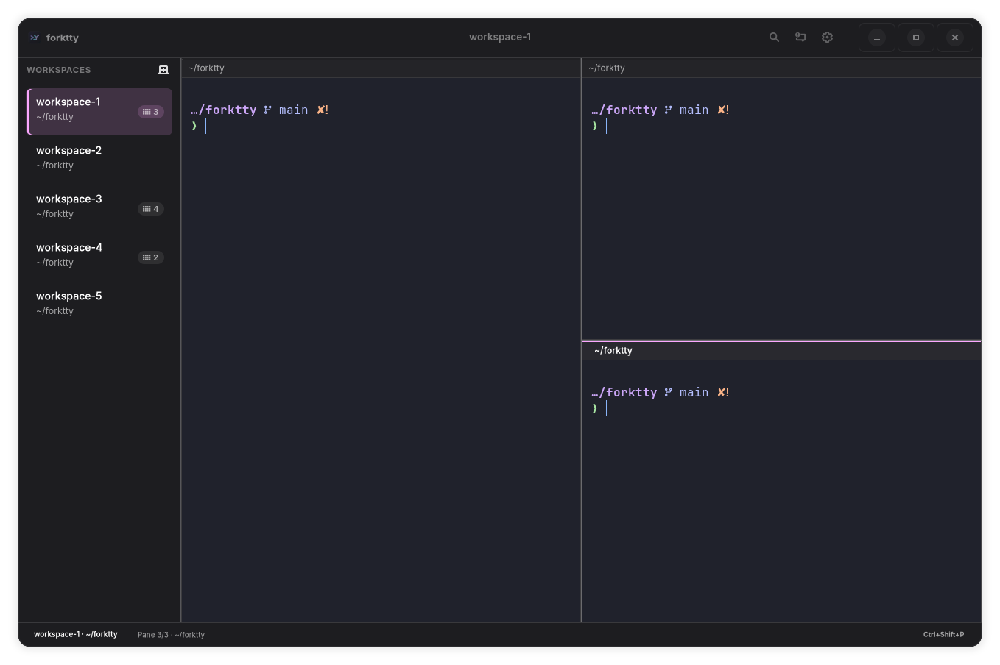

<div align="center">


# ForkTTY

**Linux-native multi-agent terminal with a programmable local socket API, first-class git worktrees, and prompt-aware notifications.**

ForkTTY runs coding agents in isolated workspaces, exposes a user-local Unix socket for automation, and can place long-running tasks in dedicated git worktrees without tying the UI to one agent vendor.

[](LICENSE)
[](https://github.com/Lucenx9/forktty/actions)
[](https://github.com/Lucenx9/forktty/releases/tag/v0.2.0-alpha.4)
[](https://rustup.rs/)
[](docs/native-gtk-vte.md)

[Download v0.2.0-alpha.4 AppImage](https://github.com/Lucenx9/forktty/releases/download/v0.2.0-alpha.4/forktty-0.2.0-alpha.4-x86_64.AppImage)

</div>

> **Status**: Early alpha (v0.2.0-alpha.4). ForkTTY is Linux-only and the GTK/VTE runtime is now the primary implementation. The AppImage is the default download for this alpha and remains experimental; the Debian package is still available for Debian/Ubuntu users.

<p align="center">
  
</p>

## Why ForkTTY

- **Agent-agnostic automation**: the same socket API and CLI flow work for Codex, Claude Code, Gemini CLI, shell scripts, and custom tools.
- **First-class worktree workflows**: create, attach, remove, and merge isolated worktree workspaces through native `git2` operations and optional `.forktty/setup` / `.forktty/teardown` hooks.
- **Native Linux terminal stack**: GTK4/libadwaita shell with embedded VTE terminals, split panes, session restore, notifications, command palette, settings, and quake mode.
- **Local-first posture**: no telemetry, no update checks, no external service dependency, owner-only Unix socket permissions, bounded request/session/config files, and argv-based command execution.

## Quick Start

### Requirements

- Linux
- [Rust 1.88+](https://rustup.rs/)
- Node.js 20+ only for the legacy development CLI helper/tests
- GTK4, libadwaita, VTE GTK4 development libraries

Debian / Ubuntu:

```bash
sudo apt install build-essential libssl-dev libgtk-4-dev libadwaita-1-dev libvte-2.91-gtk4-dev desktop-file-utils
```

Fedora:

```bash
sudo dnf install gcc gcc-c++ openssl-devel gtk4-devel libadwaita-devel vte291-gtk4-devel desktop-file-utils
```

Arch / CachyOS:

```bash
sudo pacman -S base-devel openssl gtk4 libadwaita vte4 desktop-file-utils
```

ForkTTY currently builds with libadwaita 1.4+ and VTE 0.76 or newer, matching Ubuntu 24.04 LTS and newer distro packages. For compositor-anchored quake/dropdown placement on Wayland, install `gtk4-layer-shell` as an optional runtime dependency.

### Build and Run

```bash
git clone https://github.com/Lucenx9/forktty.git
cd forktty
cargo run -p forktty-ui-gtk --features gtk-vte
```

Build the Debian package:

```bash
bash scripts/build-deb.sh
sudo dpkg -i target/packaging/deb/forktty_*.deb
```

Build the experimental AppImage:

```bash
bash scripts/build-appimage.sh
./target/packaging/appimage/forktty-0.2.0-alpha.4-*.AppImage
```

This path requires `appimagetool` on `PATH`, or `APPIMAGETOOL=/path/to/appimagetool`.

The release page also includes a Debian package and `SHA256SUMS` for both artifacts.

### First Run Basics

ForkTTY opens the current directory as the `main` workspace. Use the command palette for most navigation and pane actions:

- `Ctrl+Shift+P`: command palette
- `Ctrl+Shift+N`: new workspace
- `Ctrl+Shift+O`: open workspace
- `Ctrl+Shift+H`: split pane right
- `Ctrl+Shift+E`: split pane down
- `Ctrl+Alt+Left` / `Ctrl+Alt+Right`: focus previous/next pane
- `Ctrl+Shift+W`: close pane
- `Ctrl+B` or `F9`: toggle workspace sidebar
- `Ctrl+Shift+M`: notifications
- `F1`: keyboard shortcuts
- `Ctrl+,`: settings

## Socket CLI

ForkTTY ships a CLI over the Unix socket API:

```bash
forktty ping
forktty list
forktty focus "Workspace 2"
forktty surfaces --workspace-name main
forktty split-surface --axis vertical
forktty send-text "cargo test\n"
forktty worktree-status
forktty notify --title "Input needed" --kind prompt "Blocked on test fixture"
forktty set-status --key agent:codex --label Codex --value Running --color blue
forktty set-progress --key build --label Build --value 42 --total 100
forktty log --level warn "Waiting for reviewer input"
forktty notifications
```

Source checkouts can still run the legacy development wrapper directly with
`node scripts/forktty.mjs ...`, but packaged builds and normal usage do not
require Node.js.

Spawned shells receive:

- `TERM=xterm-256color`
- `COLORTERM=truecolor`
- `TERM_PROGRAM=ForkTTY`
- `TERM_PROGRAM_VERSION`
- `FORKTTY_WORKSPACE_ID`
- `FORKTTY_SURFACE_ID`
- `FORKTTY_SOCKET_PATH`

That lets hooks and scripts target the current workspace without extra flags.
Manual socket overrides must be absolute paths; blank or relative
`FORKTTY_SOCKET_PATH` values are ignored so the app and CLI fall back to the
default socket location.

## Agent Hooks

Install hook templates for Codex, Claude Code, and Gemini CLI:

```bash
forktty hooks setup
forktty hooks setup codex claude gemini
```

The installer merges commands into:

- Codex: `$CODEX_HOME/hooks.json` or `~/.codex/hooks.json`
- Claude Code: `$CLAUDE_CONFIG_DIR/settings.json` or `~/.claude/settings.json`
- Gemini CLI: `~/.gemini/settings.json`

When `HOME` is overridden, the `~` defaults are resolved under that home directory.

Hooks report status, progress, logs, and prompt notifications through the same local socket
pipeline. Manual hook-event commands can pass `--socket <path>` when they run outside a
ForkTTY-spawned shell.

## Features

- Native GTK4/libadwaita desktop shell with embedded VTE terminals.
- Recursive split panes, pane focus/close, command palette, settings dialog, notification panel, and workspace sidebar.
- Quake/dropdown mode through config and F12 where global shortcuts are supported.
- Direct Unix socket JSON-RPC server for workspace, surface, notification, worktree, and metadata automation.
- Git worktree create/attach/remove/merge/status with dirty-state protection and hook execution inside verified worktrees. Setup hooks are advisory; teardown hook failures or teardown-created dirty state block removal.
- Session restore for workspace order, active workspace, pane tree, focused surface, cwd, branch, and worktree metadata.
- Prompt-aware notifications from VTE shell integration signals, bounded visible prompt fallback, VTE bell, and hook/socket events.
- Bounded config/session/socket handling and local-only privacy defaults.

## Configuration

Config file: `~/.config/forktty/config.toml`. All fields are optional.

```toml
[general]
theme_source = "auto"
shell = "/bin/bash"
worktree_layout = "nested" # "nested", "sibling", or "outer-nested"
notification_command = ""

[appearance]
font_family = ""
font_size = 14
scrollback_lines = 20000
terminal_audible_bell = true
sidebar_position = "left" # "left" or "right"
sidebar_visible = true
terminal_renderer = "vte"
terminal_theme = "system" # "system", "catppuccin-mocha", "rose-pine", "tokyo-night", "dracula", or "gruvbox-dark"
window_mode = "normal" # "normal" or "quake"

[notifications]
desktop = true
sound = true
```

`notification_command` is split with `shell_words`; ForkTTY does not use `sh -c`. The first token must be an absolute executable path, and notification title/body are passed through `FORKTTY_NOTIFICATION_TITLE` and `FORKTTY_NOTIFICATION_BODY`.

`scrollback_lines` controls VTE scrollback per pane; set it to `0` to disable scrollback. `terminal_theme = "system"` follows the app light/dark scheme; named terminal themes use fixed dark palettes. `terminal_renderer` is kept for config compatibility; the native GTK app uses VTE.

See [SPEC.md](SPEC.md#config) for the full list of validated fields and their bounds.

## Session Restore

GTK/VTE sessions are stored as:

```text
~/.local/share/forktty/session-v2.json
```

ForkTTY imports legacy `session.json` when present, but saves the native runtime as v2. Restore does not preserve running PTY processes or scrollback; new VTE terminals are spawned for restored panes. Corrupt or structurally invalid session files are quarantined.

## Security Summary

- Local Linux desktop threat model; same-user processes remain part of the local trust boundary.
- Unix socket defaults to `$XDG_RUNTIME_DIR/forktty.sock` with `/tmp/forktty-<uid>/forktty.sock` fallback and owner-only permissions.
- Socket request lines, config files, and session files are size bounded.
- Shell paths, hooks, and custom notification commands use validated argv execution, not shell pipelines.
- Worktree names, socket-provided repo paths, and hook locations are validated before mutation or execution.
- ForkTTY makes no telemetry, update-check, or external network calls.

See [SECURITY.md](SECURITY.md) and [PRIVACY.md](PRIVACY.md).

## Known Limitations

- Linux only. There are no supported macOS or Windows builds.
- VTE 0.76+ is currently required by the native terminal integration.
- The AppImage is the default download but remains experimental and should be smoke-tested on the target distro before relying on it; use the `.deb` on Debian/Ubuntu when possible.
- PTYs and scrollback are not persisted across restart.
- Byte-level OSC 9/99 parsing from the old PTY-owner path is not fully ported because VTE owns the child PTY.
- Quake global shortcuts and layer-shell placement depend on desktop/compositor support.
- Full theme customization, multi-window, persistent scrollback, and browser panes are backlog items.

## Contributing

Useful commands:

```bash
cargo fmt --all --check
cargo test --workspace
cargo clippy --workspace --features gtk-vte -- -D warnings
cargo build -p forktty-ui-gtk --features gtk-vte
node --test scripts/forktty.test.mjs
desktop-file-validate packaging/linux/forktty.desktop
bash scripts/build-deb.sh
bash scripts/build-appimage.sh
```

See [SPEC.md](SPEC.md), [ROADMAP.md](ROADMAP.md), and [docs/native-gtk-vte.md](docs/native-gtk-vte.md).
Use [docs/release-qa.md](docs/release-qa.md) before tagging alpha releases.

## Inspiration

Built from scratch for Linux, inspired by [cmux](https://github.com/manaflow-ai/cmux) and other multi-agent terminal workflows.

## License

[GNU Affero General Public License v3.0](LICENSE) (`AGPL-3.0-only`)
