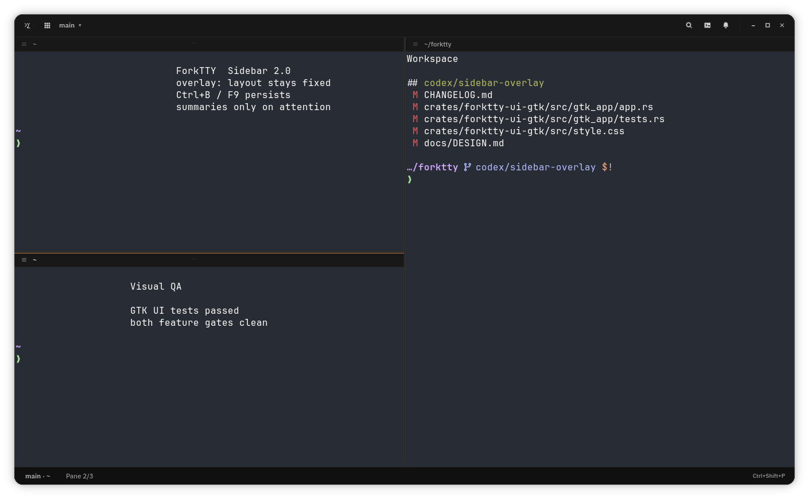

<div align="center">


# ForkTTY

**Linux-native workspace terminal with embedded Ghostty, a programmable local
socket API, first-class git worktrees, and prompt-aware notifications.**

ForkTTY runs shells and coding agents in isolated workspaces, keeps terminal
attention visible, exposes a user-local Unix socket for automation, and can
place work in dedicated git worktrees without tying the UI to one agent vendor.

[](LICENSE)
[](https://github.com/Lucenx9/forktty/actions)
[](https://github.com/Lucenx9/forktty/releases/tag/v0.2.0-alpha.20)
[](https://rustup.rs/)
[](docs/native-gtk-ghostty.md)

[Website](https://forktty.dev/) ·
[Docs](https://forktty.dev/docs) ·
[Agent context](https://forktty.dev/llms.txt) ·
[Download v0.2.0-alpha.20 AppImage](https://github.com/Lucenx9/forktty/releases/download/v0.2.0-alpha.20/forktty-0.2.0-alpha.20-x86_64.AppImage)

</div>

> **Status**: Early alpha (v0.2.0-alpha.20). ForkTTY is Linux-only and the GTK/Ghostty runtime is now the primary implementation. The AppImage is the primary Linux download for this alpha; the Debian package remains available for Debian/Ubuntu users.



For the fastest local walkthrough, read [GETTING_STARTED.md](GETTING_STARTED.md).
For local quality targets, read [METRICS.md](METRICS.md).
For the complete user guide, read [forktty.dev/docs](https://forktty.dev/docs).
For agent-oriented retrieval, start with
[llms.txt](https://forktty.dev/llms.txt) or the single-file
[llms-full.txt](https://forktty.dev/llms-full.txt). This README covers the
project overview, supported install paths, and the shortest useful workflows;
the linked guides carry the detailed contracts.

## Why ForkTTY

- **Process-agnostic automation**: the same socket and CLI primitives work for
  shells, editors, Codex, Claude Code, Pi, Antigravity CLI, OpenCode, and custom
  tools.
- **Attention without orchestration policy**: OSC and hook notifications,
  unread state, status/progress metadata, and the Agent HUD make terminal work
  visible while the process inside each pane owns its own coordination.
- **First-class worktree workflows**: create, attach, remove, and merge isolated worktree workspaces through native `git2` operations and optional `.forktty/setup` / `.forktty/teardown` hooks.
- **Native Linux terminal stack**: GTK4/libadwaita shell with embedded
  Ghostty-backed terminals, a compact overlay or pinned workspace sidebar,
  split panes, session restore, notifications, command palette, settings, and
  quake mode.
- **Local-first posture**: no crash reporting or product event tracking, an anonymous daily usage ping that can be disabled, owner-only Unix socket permissions, bounded request/session/config files, and argv-based command execution. Optional update checks hit GitHub Releases at most once per day and can also be disabled.

## Install

The fastest paths are the prebuilt artifacts from the
[v0.2.0-alpha.20 release](https://github.com/Lucenx9/forktty/releases/tag/v0.2.0-alpha.20).
Each release ships:

- `forktty-0.2.0-alpha.20-x86_64.AppImage` — recommended portable Linux package.
- `forktty-0.2.0-alpha.20-x86_64.AppImage.zsync` — AppImage delta-update metadata for external AppImage managers.
- `forktty_0.2.0.alpha.20_amd64.deb` — Debian/Ubuntu package.
- `SHA256SUMS` — checksums for release artifacts.

After downloading, verify checksums:

```bash
sha256sum -c SHA256SUMS
```

### AppImage

```bash
chmod +x forktty-0.2.0-alpha.20-x86_64.AppImage
./forktty-0.2.0-alpha.20-x86_64.AppImage
```

The AppImage carries ForkTTY's private Ghostty libraries and a bundled
GTK4/libadwaita fallback. In `auto` mode it uses host GTK only when an eager
loader probe succeeds for both ForkTTY and the embedded Ghostty library;
otherwise it selects the bundled stack. Override the choice with
`FORKTTY_APPIMAGE_GTK_RUNTIME=auto`, `host`, or `bundled`. The host still
provides glibc, display/session services, fonts, and graphics drivers, so test
the artifact on the target distro and desktop.

ForkTTY checks GitHub Releases at most once per day by default. A writable
AppImage can update itself after confirmation and SHA256 verification;
extracted, read-only, or otherwise unsafe paths fall back to the release page
so external AppImage managers remain in control. If the UI renders incorrectly,
retry with the alternate GTK OpenGL renderer name:

```bash
GSK_RENDERER=gl ./forktty-0.2.0-alpha.20-x86_64.AppImage
# or
GSK_RENDERER=ngl ./forktty-0.2.0-alpha.20-x86_64.AppImage
```

Use `GSK_RENDERER=cairo` only as a slower software-rendering fallback. More
diagnostics are available in [SUPPORT.md](SUPPORT.md).

### Debian / Ubuntu (.deb)

The `.deb` targets Debian 13/Trixie or newer and Ubuntu 24.04 LTS or newer.
Debian 12/Bookworm is below the package baseline because it does not provide
libadwaita 1.4+.

```bash
sudo apt install ./forktty_0.2.0.alpha.20_amd64.deb
# or, if apt cannot read the file path directly:
sudo dpkg -i forktty_0.2.0.alpha.20_amd64.deb
sudo apt -f install
```

The package installs the `forktty` binary, the desktop entry, and the
icon. Removing it (`sudo apt remove forktty`) cleans up
`/usr/bin/forktty` and the desktop integration.

### Build from source

Requirements:

- Linux
- [Rust 1.96+](https://rustup.rs/)
- GTK4 and libadwaita development files
- `git`, Zig, and the full Ghostty source submodule for the vendored Ghostty
  terminal libraries
- No system Ghostty package is required; source and packaged builds use the
  pinned vendored Ghostty libraries

Developer repository checks also expect the full Ghostty source submodule:

```bash
git submodule update --init vendor/ghostty
```

Debian / Ubuntu:

```bash
sudo apt install build-essential libssl-dev libgtk-4-dev libadwaita-1-dev git zig desktop-file-utils
```

Fedora:

```bash
sudo dnf install gcc gcc-c++ openssl-devel gtk4-devel libadwaita-devel git zig desktop-file-utils
```

Arch / CachyOS:

```bash
sudo pacman -S base-devel openssl gtk4 libadwaita git zig desktop-file-utils
```

Source builds require libadwaita 1.4+, matching Debian 13/Trixie, Ubuntu
24.04 LTS, and newer distro packages. Release AppImages include GTK4 and
libadwaita as a fallback plus private gtk4-layer-shell; `auto` mode still uses a
compatible host GTK stack when its eager loader probe succeeds.

Clone and run:

```bash
git clone https://github.com/Lucenx9/forktty.git
cd forktty
git submodule update --init vendor/ghostty
scripts/ghostty-gtk-lib-probe.sh --ensure --print-path
cargo run -p forktty-ui-gtk
```

Packaged builds are GTK/Ghostty-only. The experimental WebKitGTK browser pane
remains in source behind the opt-in `browser` feature; it is not shipped in
the AppImage or `.deb` for this alpha.

For the explicit terminal-only build used by release artifacts:

```bash
cargo run -p forktty-ui-gtk --no-default-features --features gtk-ghostty
```

For the source-only browser experiment, install WebKitGTK 6 development files
and opt in:

```bash
cargo run -p forktty-ui-gtk --no-default-features --features browser
```

Contributor setup and the complete local gate live in
[CONTRIBUTING.md](CONTRIBUTING.md). Packaging, signing, and artifact smoke tests
live in [RELEASING.md](RELEASING.md) and
[docs/release-qa.md](docs/release-qa.md).

## First Run

### Check the environment

After install, confirm the runtime looks healthy:

```bash
forktty --version
forktty doctor
```

`forktty doctor` is a local-only inspector. It reports the resolved
config, session, socket, hook config paths, and known recovery behaviors,
and exits 0 on a clean environment or 2 with explicit warnings. Use
`forktty --json doctor` when you also need the socket doctor report with
environment, executable, and hook config paths.

### Default workspace and shortcuts

ForkTTY opens the current directory as the `main` workspace. Use the
command palette for most navigation and pane actions:

- `Ctrl+Shift+P`: command palette
- `Ctrl+Shift+N`: new workspace
- `Ctrl+Shift+O`: open workspace
- `Ctrl+Shift+H`: split pane right
- `Ctrl+Shift+E`: split pane down
- `Ctrl+Shift+T`: new tab in the focused pane
- `Ctrl+Shift+W`: close pane
- `Ctrl++`/`Ctrl+=`, `Ctrl+-`, `Ctrl+0`: zoom terminal panes
- `Ctrl+B` or `F9`: toggle the workspace sidebar; unpinned it overlays panes,
  while pinned it reserves space beside them
- Agents: titlebar button or command palette
- `Ctrl+Shift+M`: notifications
- `Ctrl+?` (`F1` also works): keyboard shortcuts
- `Ctrl+,`: settings
- `F10`: main menu when focus is outside terminal content; terminal panes keep
  plain `F10` for TUI apps

## Socket CLI

The same `forktty` binary exposes a user-local Unix socket and CLI for terminal
workspace automation. The socket is intentionally limited to primitives that
are useful for shells, editors, scripts, and coding agents alike: workspaces,
panes, terminal text, notifications, status/progress/log metadata, worktrees,
project actions, remotes, and a thin agent-session lifecycle adapter.

Diagnostic commands work even when the GTK app is not running:

```bash
forktty --help
forktty --version
forktty doctor
forktty worktree-doctor --cwd "$PWD" --json
```

Common live-socket commands:

```bash
forktty ping
forktty list
forktty focus main
forktty surfaces --workspace-name main
forktty split-surface --axis horizontal
forktty read-screen --scope visible
forktty capture-tail --lines 40
forktty notify "Build complete" --title Build
forktty notifications --limit 50
forktty context-snapshot --workspace-name main --json
forktty worktree-list --cwd "$PWD"
```

Use `forktty capabilities --json` for the runtime method list and
`forktty examples` for compact examples. ForkTTY exposes terminal and workspace
primitives, not task routing, provider-neutral team state, a built-in MCP
server, or managed agent skills.

Socket requests are one JSON-RPC object per line over the owner-only Unix
socket at `$XDG_RUNTIME_DIR/forktty.sock` (with an owner-only fallback under
`/tmp/forktty-<uid>/`). Before sending requests, official CLI and hook clients
verify that the connected server's `SO_PEERCRED` uid matches their effective
uid. Request/response bounds, notification cursors, worktree transaction
guarantees, shutdown behavior, and stability tiers are documented in
[SPEC.md](SPEC.md#socket-api) and
[docs/socket-api.md](docs/socket-api.md).

### Upgrading from orchestration builds

Older releases may have left marker-owned MCP registrations or a managed agent
skill in external tool configuration. The current binary deliberately leaves
those files untouched. Follow the ownership-safe removal procedure in
[docs/socket-api.md](docs/socket-api.md#removed-orchestration-migration).

## Agent Hooks

Install hook templates for Codex, Claude Code, Antigravity CLI, and OpenCode:

```bash
forktty hooks setup                       # install default agents
forktty hooks setup codex                 # install just one
forktty hooks setup codex claude --dry-run
forktty hooks setup --full claude         # include Claude per-tool hooks
forktty hooks remove opencode             # remove ForkTTY-managed hooks/plugin
forktty hooks remove gemini               # cleanup legacy Gemini config only
```

`--dry-run` previews the merge. Setup writes atomically, preserves unrelated
entries, and creates timestamped backups when content changes. Hooks remain
optional and are never installed or refreshed automatically. Claude uses its
lower-frequency lifecycle profile by default; `--full` adds per-tool hooks.
`hooks remove gemini` exists only for legacy cleanup and does not enable Gemini
setup.

Settings > Agent hooks shows the installed providers before any action. Setup,
update, and repair require confirmation; Remove deletes only ForkTTY-managed
entries and leaves unrelated agent configuration untouched. Hooks report
lifecycle and attention state; they never move focus or rearrange panes.

Diagnose an installed integration with:

```bash
forktty hooks doctor codex     # inspect socket, launcher, env, hook config
forktty hooks test codex       # round-trip a status update through the socket
```

Hooks publish lifecycle, progress, logs, and prompt notifications through the
same local socket without taking over task planning. Installation paths,
provider event coverage, disable variables, trust checks, and lifecycle
semantics are documented in [hooks/README.md](hooks/README.md) and
[docs/agents.md](docs/agents.md).

If a lifecycle hook keeps the workspace id but loses or carries a stale pane
id, ForkTTY can recover the session from its live learned target or one unique
same-cwd surface inside that workspace. Ambiguous or missing targets fail
without publishing a hidden agent status, and a corrected hook retry remains
eligible.

Codex can run hooks from a shared app-server that lacks the terminal pane's
`FORKTTY_*` environment. ForkTTY still restores the workspace badge for a
local `codex-tui` session when exactly one unclaimed Codex TUI process has the
same cwd and belongs to one eligible ForkTTY surface. An additional Codex TUI
in that cwd, including one outside ForkTTY, makes the fallback fail closed.

## Configuration

Config file: `~/.config/forktty/config.toml`. All fields are optional. The
Settings dialog intentionally does not edit `general.shell`; change the shell by
editing this file or your login shell environment.

```toml
[general]
shell = "/bin/bash"
worktree_layout = "nested" # "nested", "sibling", or "outer-nested"
enable_pr_lookup = false
notification_command = ""
persist_terminal_processes = false

[appearance]
persistent_scrollback_lines = 0
sidebar_position = "left" # "left" or "right"
sidebar_visible = true
sidebar_pinned = false
window_mode = "normal" # "normal" or "quake"

[notifications]
desktop = true
sound = true
blocked_terminal_apps = []
blocked_terminal_types = []

[updates]
auto_check = true

[telemetry]
anonymous_ping = true
```

`notification_command` uses validated argv execution rather than `sh -c`.
`persistent_scrollback_lines` stores a bounded plain-text tail, while
`persist_terminal_processes` uses `dtach` when available so plain local terminal
processes can survive a GTK restart. Both are off by default; agent, SSH,
browser, and project-action panes keep their own lifecycle rules.

Terminal fonts, colors, scrollback, scrollbar, bell, cursor, and cell sizing
come from Ghostty's config at `~/.config/ghostty/config.ghostty` (or the legacy
`~/.config/ghostty/config`). No system Ghostty installation is required.

`updates.auto_check = true` checks GitHub Releases no more than once every 24 hours. The stamp is written on both success and failure so offline machines are not probed on every launch.

`telemetry.anonymous_ping = true` sends at most one GTK-startup ping per UTC day to `https://forktty.dev/api/telemetry/ping`. The JSON body is limited to `schema`, `kind`, `app`, `version`, and `date`; it contains no install id, username, hostname, cwd, repository path, branch, shell, agent metadata, terminal buffer, socket payload, or crash data. Set it to `false` to disable the ping.

See [SPEC.md](SPEC.md#config) for the full list of validated fields and their bounds.

## Session Restore

GTK/Ghostty sessions are stored as:

```text
~/.local/state/forktty/session-v2.json
```

ForkTTY imports legacy `session.json` when present, but saves the native runtime as v2. By default restore re-spawns fresh Ghostty-backed terminals; scrollback restore is limited to the opt-in plain-text tail controlled by `persistent_scrollback_lines`, and embedded Ghostty panes source that tail from the bounded end of full scrollback when the limited ABI is available. With `general.persist_terminal_processes = true` and `dtach` available, plain terminal process trees survive through the broker and restored panes re-attach by persisted surface id. If the setting is false on startup, old ForkTTY-managed broker sessions are cleaned before restore. Corrupt or structurally invalid session files are quarantined.

## Security Summary

- Local Linux desktop threat model; same-user processes remain part of the local trust boundary.
- Unix socket defaults to `$XDG_RUNTIME_DIR/forktty.sock` with `/tmp/forktty-<uid>/forktty.sock` fallback and owner-only permissions; the server authenticates connecting peers, and official clients authenticate the server peer before sending requests.
- Socket request lines, config files, and session files are size bounded.
- Shell paths, hooks, and custom notification commands use validated argv execution, not shell pipelines.
- Worktree names, socket-provided repo paths, and hook locations are validated before mutation or execution.
- ForkTTY makes no crash-reporting or product event-tracking network calls. With `telemetry.anonymous_ping = true`, the GTK app sends one anonymous daily usage ping; set it to `false` to disable it. With `updates.auto_check = true`, the GTK app checks GitHub Releases at most once per day; browser panes and PR lookup remain optional/user-directed network paths. The shipped AppImage and `.deb` do not embed a browser runtime.

See [SECURITY.md](SECURITY.md) and [PRIVACY.md](PRIVACY.md).

## Known Limitations

- Linux only. There are no supported macOS or Windows builds.
- libadwaita 1.4+ is required by the native terminal integration.
- The AppImage ships a bundled GTK4/libadwaita fallback plus Ghostty and gtk4-layer-shell, but prefers the host GTK stack only when the eager loader compatibility probe succeeds; it still relies on the host's glibc, fontconfig, OpenGL/Vulkan/Mesa driver stack, display-server libraries, and desktop session services. Test it on the target distro/desktop environment; prefer the `.deb` on Debian/Ubuntu when package-manager integration matters.
- PTY/process persistence is opt-in for plain terminal panes through `general.persist_terminal_processes` and requires `dtach`; by default restored sessions spawn fresh shells. Scrollback persistence is opt-in, plain-text only, and bounded.
- OSC 9 and basic OSC 99 terminal notifications are parsed from the Ghostty-owned PTY stream and rate-limited per surface; OSC 99 title/body base64 payloads and same-id title/body chunks are decoded with multipart title/body kept separate, same-id update/close controls affect ForkTTY's notification model, and in-app Open/Dismiss/Clear All plus basic same-id buttons can send OSC 99 reports. Targeted desktop notifications expose a best-effort Open action, notification dismiss/clear closes matching desktop and OSC 99 tracked notifications, icon names, application-name icon fallback, application/type filtering metadata, occasion filtering, urgency, expiry, and sound metadata inform notification handling, positive `w` expiry values dismiss in-app notifications, and bounded `p=icon` data can be cached by `g`; broader chunk lifecycle behavior remains partial.
- Quake global shortcuts and layer-shell placement depend on desktop/compositor support.
- Agent hibernation/suspend UI, provider-side session existence checks, full theme customization, multi-window, and browser history/bookmark GTK address-bar integration are backlog items.
- Browser panes are source-only and experimental in this alpha; use `--features browser` only when intentionally testing that path.

## Troubleshooting

- `forktty doctor` is the first stop: it explains config, session, socket, and hook config problems before they trigger a launch failure. Use `forktty --json doctor` for socket, environment, executable, and hook diagnostics.
- If terminal panes report `ghostty-gtk-embed.so` as missing in a source tree,
  run `git submodule update --init vendor/ghostty` and
  `scripts/ghostty-gtk-lib-probe.sh --ensure --print-path`. For packaged
  builds, rebuild or reinstall with `bash scripts/build-deb.sh` or
  `bash scripts/build-appimage.sh`; the packagers install the verified library
  into `usr/lib`.
- If the GTK app refuses to start, run it from a terminal to see GLib/GTK error output, then re-run `forktty doctor`.
- The local socket lives at `$XDG_RUNTIME_DIR/forktty.sock` (or `/tmp/forktty-<uid>/forktty.sock`). Stale or foreign sockets are refused on startup; remove them by hand only after confirming no other ForkTTY instance owns them.
- A corrupt `~/.config/forktty/config.toml` or `~/.local/state/forktty/session-v2.json` is renamed aside as `*.bad-<timestamp>` so the app can start with defaults; the rename reason is logged to stderr.
- Local logs live under `~/.local/share/forktty/logs/`.

## Support

For usage questions and bug reports, start with [SUPPORT.md](SUPPORT.md)
and include the output of `forktty doctor`, your distro/desktop
environment, install method, and the exact command or workflow that
failed. Security reports should follow [SECURITY.md](SECURITY.md).

## Contributing

Start with [CONTRIBUTING.md](CONTRIBUTING.md) for the development environment,
workflow, and complete pre-PR gate. Architecture and scope live in
[SPEC.md](SPEC.md) and [ROADMAP.md](ROADMAP.md); maintainers should follow
[RELEASING.md](RELEASING.md) and
[docs/release-qa.md](docs/release-qa.md) when cutting an alpha.

## Inspiration

Built from scratch for Linux, inspired by [cmux](https://github.com/manaflow-ai/cmux) and other multi-agent terminal workflows.

## License

[GNU Affero General Public License v3.0](LICENSE) (`AGPL-3.0-only`)
